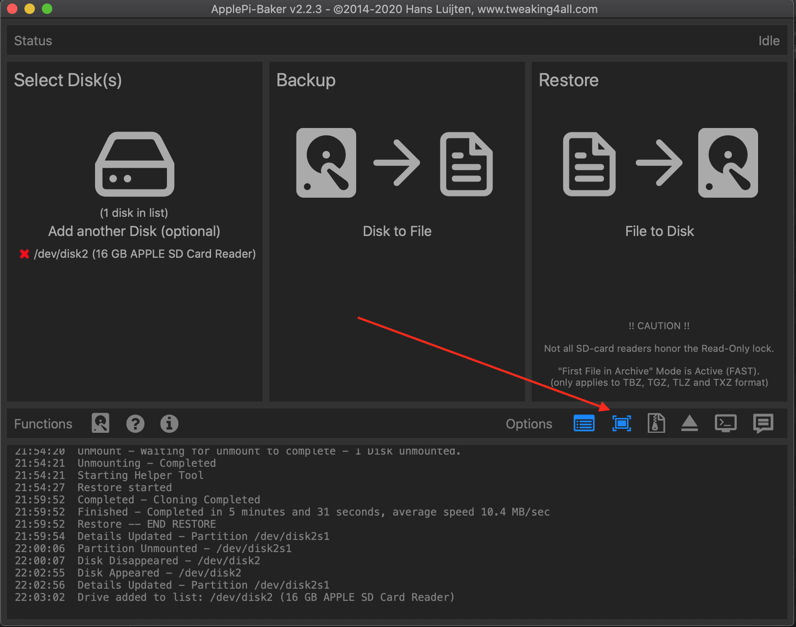
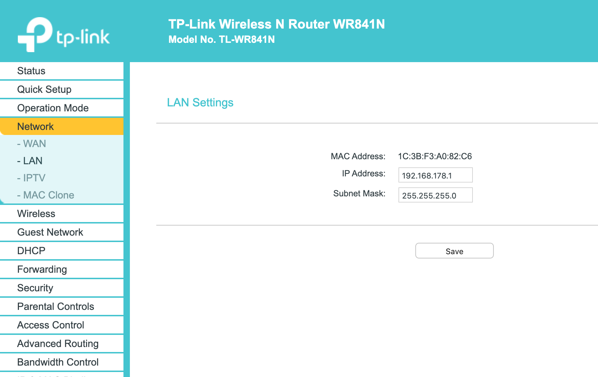
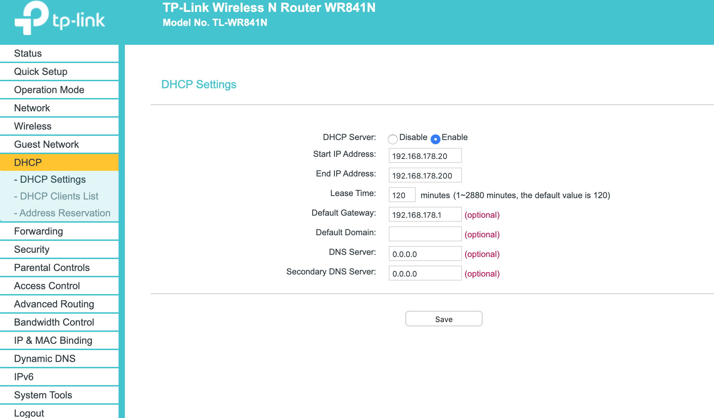

# Ordermanager

## Installation on raspberry3

### Read/Write images
To create images from an sd card or writing an image to an sd card use applePi-Baker

<b>Important</b>: remember to set the expand flag, otherwise the images are not working on other sdcards.

### Install Fresh Raspberry

1. Download the [Raspberry pios lite](https://downloads.raspberrypi.org/raspios_lite_armhf_latest) from [here](https://www.raspberrypi.org/downloads/raspbian/)
2. Use ApplePi-Baker (see hardware_setup/images-Folder) to copy to sd card.

#### Add ssh key of machine on raspberry pi:
        
        ssh-copy-id pi@192.168.178.51
This will add the ssh keys of the mac to the raspberry.
See: https://www.raspberrypi.org/documentation/remote-access/ssh/passwordless.md

### Prepare Raspberry: Server
1. Enable ssh directly at raspberry with typing 
    
        sudo raspi-config
   
   Interface Options -> ssh-> yes
2. install java
       
        sudo apt update
        sudo apt upgrade
        sudo apt install default-jdk

#### Assign static ip address for wifi. 
Open file:

        sudo nano /etc/dhcpcd.conf

Insert the following block in case ip's start with 192.168.178.XXX otherwise adjust the ip:

        interface wlan0
        static ip_address=192.168.178.99/24
        static ip6_address=fd51:42f8:caae:d92e::ff/64
        static routers=192.168.178.1
        static domain_name_servers=192.168.178.1 8.8.8.8 fd51:42f8:caae:d92e::1
See: https://www.elektronik-kompendium.de/sites/raspberry-pi/1912151.htm

#### Copy jar file from mac to raspberry

1. Copy file to home dir of pi user via:

        scp ./target/order-manager-1.0.0.jar pi@<IP>:
    
#### Create systemd service

1. Copy service file

        scp ./raspberry/ordermanager.service pi@<IP>:ordermanager.service
1. ssh to pi.
1. make jar executable:
            
        chmod +x order-manager-1.0.0.jar
1. copy service file:
   
        sudo cp ordermanager.service /etc/systemd/system/ordermanager.service
1. start service:

        sudo systemctl start ordermanager.service
1. check state
    
        sudo systemctl status ordermanager.service
1. enable service so it gets started on boot

        sudo systemctl enable ordermanager.service
  
  
### Prepare Raspberry: UI

#### To start chrome in fullscreen without mouse pointer 
    
    	sudo apt-get install unclutter

		
Now add to /etc/xdg/lxsession/LXDE-pi/autostart :

        @unclutter -idle 0.1
        @xset s off
        @xset -dpms
        @xset s noblank
        @/home/pi/Desktop/ordermanager.sh
        

Create file:

		touch /home/pi/Desktop/ordermanager.sh
		
and make it executable
        
        chmod +x /home/pi/Desktop/ordermanager.sh
        
ausführbar machen

Und folgendes einfügen

        #!/bin/bash
        sleep 10
        chromium-browser --incognito --autoplay-policy=no-user-gesture-required --disable-infobars --incognito --noerrdialogs --disable-translate --kiosk http://192.168.178.99:8080/orders
        
        
# Router
In order to use the same static ip in private wifi and customer wifi, we need to use ips like: 192.168.178.X. This will help when switching the networks.
Therefore we need change the dhcp setting. To do this set the following in the router-ui:

1. Set ip of router to 192.168.178.1

2. Set dhcp range

# Troubleshooting

## Rapsi does not connect to wifi raspi-config or desktop
In case raspi does not connect even when password is correct, check:

    sudo nano /etc/wpa_supplicant/wpa_supplicant.conf

And make sure the desired network is in first place.

See: https://www.raspberrypi.org/documentation/configuration/wireless/wireless-cli.md

    